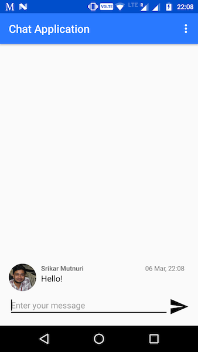

# ChatApplication
### `(Major WIP)`

A simple Android chat application using Firebase. I've made this to explore Firebase and Android.

This is a somewhat modified version of [Firebase Android Codelab](https://codelabs.developers.google.com/codelabs/firebase-android/#0) from Google Codelabs. 

All the registered users would be participating in a group chat, with all messages visible to everyone.  

I've changed the signin method to e-mail based and added a timestamp to the messages, and removed a feature which enables image sharing. 

###### Steps to run:
  * Open firebase console, create new project and add Firebase to Android.
  * Give a package name (`com.srikarmutnuri.chatapp` in my case)
  * Download the `google-services.json` shown, add it to the `app` folder
  * Check if the correct dependencies are all present in your `build.gradle`.
  * Refactor code to reflect the package name you've given earlier.
  * Build and run the project in Android Studio.

You _might_ encounter errors with the database URL. So I recommend using this project as a reference to build your own version. Better yet, follow the Codelabs tutorial I've linked to earlier.

###### TODO:
  * (Current, major) Optimize code.
  * (Current) Enable one-to-one messaging.
  * (Current) Enable notification service
  * (Later) Add an encryption layer

  ----WILL BE UPDATING THIS----
  
